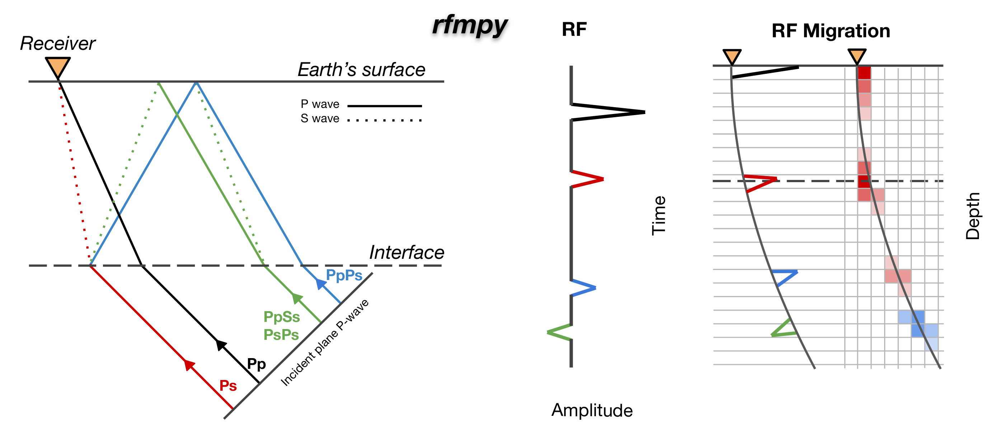

Welcome to the *rfmpy* repository! 
------------
The codes found here calculate **receiver function (RF) and 
perform time to depth migration** for mapping the **Moho** discontinuity (boundary between the Earth's crust and mantle), 
in a 3D spherical coordinate system. 

We use these codes examine the Moho depth variations for the broader European
Alpine region, based on four temporary seismic networks (i.e., AASN, EASI, CIFALPS, PACASE).

For more details on this project, have a look at our 
**[paper](https://essd.copernicus.org/articles/15/2117/2023/essd-15-2117-2023.html)** entitled _“Moho depths beneath the European Alps: a homogeneously processed map and receiver functions database”_, 
published at Earth System Science Data (ESSD). 

The receiver function dataset, used in this project
is **open access** and can be accessed at this [Zenodo repository](https://zenodo.org/record/7695125).

## 🆕 Application to map the Mantle-Transition-Zone 
This project, led by D. Kalmár (DK), focuses on investigating the mantle transition zone (MTZ) beneath Central and Eastern Europe. 
The study uses seismic data collected from various temporary and permanent seismic networks in the region.
DK, along with LP and GH developed an updated version of `rfmpy` tailored for studying the MTZ. For more details:

- Kalmár, D., Petrescu, L., Hetényi, G., Michailos, K., Süle, B., Neagoe, C., Bokelmann, G., and the AlpArray and PACASE Working Groups
(**Submitted to JGR - Solid Earth**). _Mantle Transition Zone analysis using P-to-S receiver functions in the Alpine-Carpathian-Dinarides Region: impact of plumes and slabs._

📓Documentation
------------
Documentation is available **[here](https://rfmpy.readthedocs.io)**.

📃 How to Cite
------------
If you use `rfmpy`, consider citing _Michailos et al. (2023)._

- Michailos, K., Hetényi, G., Scarponi, M., Stipčević, J., Bianchi, I., Bonatto, L.,
  Czuba, W., Di Bona, M., Govoni, A., Hannemann, K., Janik, T., Kalmár, D., Kind, R.,
  Link, F., Lucente, F. P., Monna, S., Montuori, C., Mroczek, S., Paul, A.,
  Piromallo, C., Plomerová, J., Rewers, J., Salimbeni, S., Tilmann, F., Środa, P.,
  Vergne, J., and the AlpArray-PACASE Working Groups (2023). _Moho depths beneath the European
  Alps: a homogeneously processed map and receiver functions database._ Earth Syst. Sci. Data, 15, 2117–2138.

⚠️ Notes
------------
Please note that, at this stage, the codes are primarily designed to 
reproduce our results. For other applications, modifications may be necessary.

The codes are currently under active development and may change at any time. 
We welcome contributions from the community, including suggestions for improvements, error reports, and other feedback.