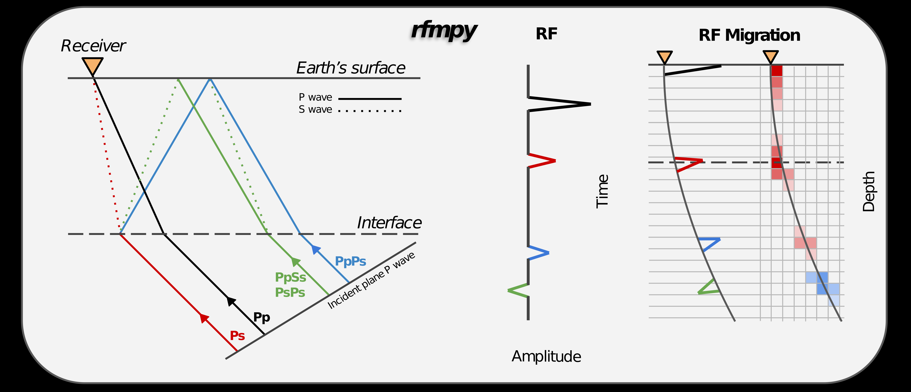

Description 
------------
Python codes to calculate receiver function (RF) and 
perform time to depth migration (WIP), in a 3D spherical coordinate system. 

Fore more details on this project have a look at our EGU 2022 abstract [here](https://meetingorganizer.copernicus.org/EGU22/EGU22-8174.html).

<!---
Add zenodo here

--->

Installation
------------
Installation instructions can be found [here](docs/installation.md).

Tutorial
------------
A short tutorial on how to run the codes can be found [here](docs/tutorial.md).

 
### Tests

* Comparisons with Matlab codes are in good agreement (at least for the larger spikes).
* Test for all available data within 30 days took ~28 minutes (first 30 days of 2016).

### To do: ###
* Write more tests []
* Code review/editing []
* Check that modified codes give same results as original codes MS sent [DONE]
* Rotate to Z-E-N before we rotate to R-T-Z [DONE]
* QC tests doublecheck we read the right chuncks of the data [DONE]  

Note
------------
Codes are currently at development and are subject to 
change at any time... Also please note that the codes are designed to reproduce our results.
For different applications the codes will need to be modified.

See also other receiver function projects:
------------
* [seispy](https://github.com/xumi1993/seispy) 
* [RFPy](https://github.com/paudetseis/RfPy) 
* [rf](https://github.com/trichter/rf) 

