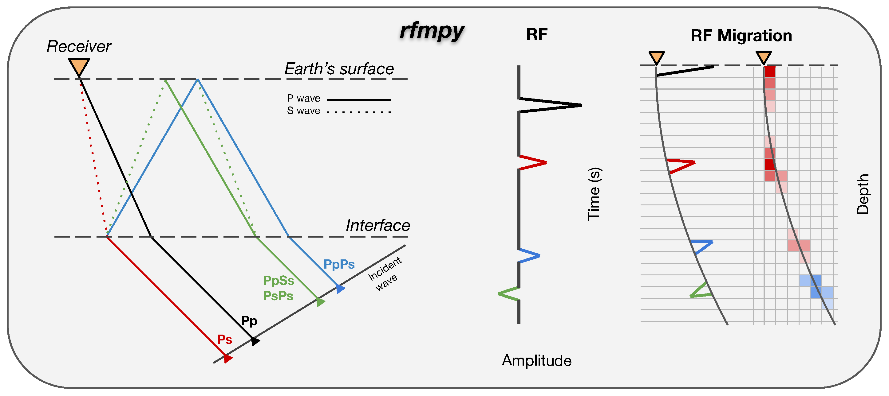

## rfmpy - Receiver_Function_Migration_Py



### Description 
Python codes to reproduce results for receiver function (RF) calculations and 
performing time to depth migration (WIP), in a 3D spherical coordinate system, to the RFs 
from manuscript submitted in ...

Original codes provided by Matteo Scarponi.

Author: [`Konstantinos Michailos`](https://github.com/kemichai) (Developer and Maintainer) 


#### Installation:
The simplest way to run the codes is using anaconda and a virtual environment.
This way you won't damage your system python.
If you do not already have an anaconda or miniconda install go to the
conda-install instructions and get yourself either of the two [conda-install](https://docs.conda.io/en/latest/miniconda.html).

Once you have installed conda, create a new environment with the following dependencies using:
```bash
conda config --add channels conda-forge
conda create -n rfmpy python=3.6 pip obspy=1.2.1 matplotlib numpy pandas basemap cartopy shapely fortran-compiler
conda activate rfmpy
conda install -c anaconda ipython=7.13
```

Install from source:
```bash
git clone https://github.com/kemichai/rfmpy.git
cd rfmpy
```
Once you clone the project open a terminal in the
top directory (the one containing setup.py) and type the 
following to install the functions and make em
 available everywhere on your machine (within your environment).
```bash
pip install .
```


### Version
0.0.1

### Note
Codes are currently at development and are subject to 
change at any time. Codes are designed to reproduce our results.
For different applications the codes will need to be modified.
 
### Tests
* Comparisons with Matlab codes are in good agreement (at least for the larger spikes).
* Test for all available data within 30 days took ~28 minutes (first 30 days of 2016).

### To do: ###
* Write more tests []
* Code review/editing []
* Check that modified codes give same results as original codes MS sent [DONE]
* Rotate to Z-E-N before we rotate to R-T-Z [DONE]
* QC tests doublecheck we read the right chuncks of the data [DONE]  

