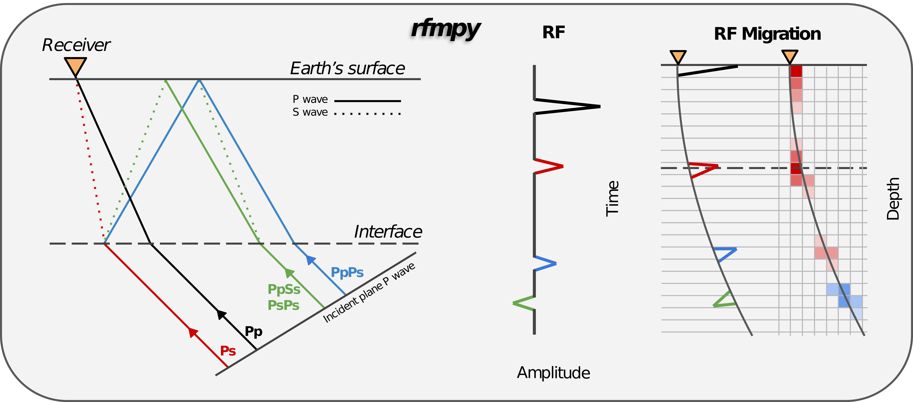

Description 
------------
Python codes to calculate receiver function (RF) and 
perform time to depth migration (WIP), in a 3D spherical coordinate system. 

Fore more details on this project have a look at our EGU 2022 abstract [here](https://meetingorganizer.copernicus.org/EGU22/EGU22-8174.html).

<!---
Add zenodo here

--->

Installation
------------
Installation instructions can be found [here](docs/installation.md).

Tutorial
------------
A short tutorial on how to use the codes can be found [here](docs/tutorial.md).

 
### Tests

* Test for all available data within 30 days took ~28 minutes (first 30 days of 2016).

### To do: ###
* Check that modified codes give same results with Matteo's codes [DONE]
* Check that our codes give similar results with Matlab codes [DONE]

Note
------------
Codes are currently at development and are subject to 
change at any time... Also please note that the codes are designed to reproduce our results.
For different applications the codes will need to be modified.

See also other receiver function projects:
------------
* [RF](https://rf.readthedocs.io/en/latest/index.html) -  Python framework for receiver function analysis.
* [RfPy](https://paudetseis.github.io/RfPy/) - Python tools for calculating teleseismic receiver functions.
* [seispy](https://github.com/xumi1993/seispy) -  Python module for processing seismological data and calculating Receiver Functions.
