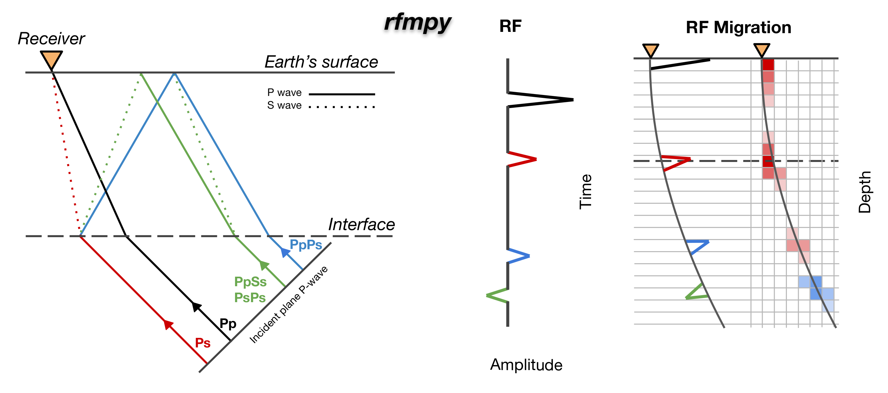

===================================================
Receiver functions and time-to-depth migration calculations
===================================================

``rfmpy`` calculates **receiver function (RF) and perform time to depth migration** for mapping
the **Moho** discontinuity (boundary between the Earth's crust and mantle),
in a 3D spherical coordinate system.

We use these codes to examine variations in Moho depth across the broader European Alpine region, leveraging data
from four temporary seismic networks: AASN, EASI, CIFALPS, and PACASE.
For more details, refer to our paper `Michailos et al., 2023 <https://essd.copernicus.org/articles/15/2117/2023/essd-15-2117-2023.html>`__. The
open-access receiver function dataset used in this project is available on the following `Zenodo repository <https://zenodo.org/record/7695125>`_.

``rfmpy`` is actively developed on `GitHub <https://github.com/kemichai/rfmpy/>`_.

--------------

🆕 **Application to map the Mantle-Transition-Zone**

We have recently expanded the functionality of ``rfmpy`` to enable mapping of the mantle transition zone (MTZ -
including the 410 km, 520 km, and 660 km discontinuities).
This project, led by D. Kalmár, focuses on mapping the MTZ beneath Central and Eastern Europe to enhance our
understanding of active tectonic and geodynamic processes.

Quickstart
~~~~~~~~~~~
- To install ``rfmpy`` have a look `here <https://rfmpy.readthedocs.io/en/latest/install.html>`__.
- `Tutorials <https://rfmpy.readthedocs.io/en/latest/tutorial.html#>`__ show an example of mapping the Moho and the Mantle Transition Zone discontinuities.

How to Cite
~~~~~~~~~~~~
If you use ``rfmpy``, consider citing the related publication:

- Michailos, K., Hetényi, G., Scarponi, M., Stipčević, J., Bianchi, I., Bonatto, L.,
  Czuba, W., Di Bona, M., Govoni, A., Hannemann, K., Janik, T., Kalmár, D., Kind, R.,
  Link, F., Lucente, F. P., Monna, S., Montuori, C., Mroczek, S., Paul, A.,
  Piromallo, C., Plomerová, J., Rewers, J., Salimbeni, S., Tilmann, F., Środa, P.,
  Vergne, J., and the AlpArray-PACASE Working Groups, (published at ESSD), 2023.

.. toctree::
   :hidden:
   :maxdepth: 1
   :caption: Get started

   install

.. toctree::
   :hidden:
   :maxdepth: 1
   :caption: Tutorials

   tutorial
