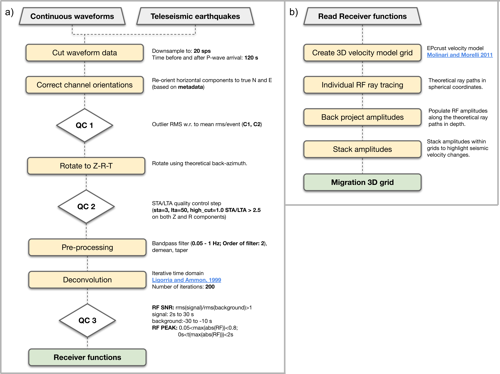

Example using a subset of data
==============

Introduction
~~~~~~~~~~~~
Here you can find a tutorial for calculating receiver functions and time-to-depth
calculation for a given subset of seismic waveform data from the EASI seismic network. Note
that this is only a small sample of all the available data and its only purpose
is to show the functionality of the codes. The example dataset is available in the
following `link <https://zenodo.org/record/7065029#.YxtWIdJByut>`__.

Here we start from continuous data cut around the arrival times of selected teleseismic events
and apply a systematic processing routine (see Figure 1 for details on the steps we follow).

    Processing steps for Receiver Function and time-to-depth migration calculations within ``rfmpy``.

Download example dataset
~~~~~~~~~~~~
First we need to download the seismic waveform data from a ZENODO
repository in our local computer.

1. Create a directory to store the waveform data:

.. code:: bash

   $ mkdir ~/Desktop/data_sample

2. Download the data sample from ZENODO in that directory:

.. code:: bash

   $ wget https://zenodo.org/record/7065029/files/seismic_data.tar.xz -P ~/Desktop/data_sample/

.. parsed-literal::

    [2022-09-27 15:56:54]  https://zenodo.org/record/7065029/files/seismic_data.tar.xz
    Resolving zenodo.org (zenodo.org)... 188.184.117.155
    Connecting to zenodo.org (zenodo.org)|188.184.117.155|:443... connected.
    HTTP request sent, awaiting response... 200 OK
    Length: 141181064 (135M) [application/octet-stream]
    Saving to: ‘~/Desktop/data_sample/seismic_data.tar.xz’
    seismic_data.tar.xz.2             100%[==========================================================>] 134.64M  8.43MB/s    in 13s
    [2022-09-27 15:57:08] (10.2 MB/s) - ‘~/Desktop/data_sample/seismic_data.tar.xz’ saved [141181064/141181064]

3. Extract files from the tar file we just downloaded:

.. code:: bash

   $ tar -xf ~/Desktop/data_sample/seismic_data.tar.xz --directory ~/Desktop/data_sample

4. Create a directory to store RFs:

.. code:: bash

    $ mkdir ~/Desktop/data_sample/RF
    $ mkdir ~/Desktop/data_sample/TRF

Calculate receiver functions
~~~~~~~~~~~~

Run the following, code snippet from the repository's top folder to compute receiver functions.

.. code:: ipython3

    import rfmpy.core.RF_Main as RF
    from obspy import read_inventory, read_events, UTCDateTime as UTC
    import os
    import time

    # Define working directory
    work_dir = os.getcwd()

    # Path in which waveforms are stored
    path_wavs = ['/home/' + work_dir.split('/')[2] + '/Desktop/data_sample/EASI/data/']

    # Define path to store RFs
    path_out_RF = '/home/' + work_dir.split('/')[2] + '/Desktop/data_sample/'

    # Start a timer to keep a track how long the calculations take
    t_beg = time.time()

    # Path for StationXML files
    path_meta = work_dir + '/data/metadata/'
    try:
        print('>>> Reading inventory...')
        inv = read_inventory(path_meta + '/*.xml')
        print('>>> Read inventory...')
    except Exception as e:
        raise type(e)('>>> Move to the top directory of the repository!')

    # =================================================== #
    # Define parameters for calculating receiver functions
    # Define sta/lta parameters
    sta_lta_qc_parameters = {'sta': 3, 'lta': 50, 'high_cut': 1.0, 'threshold': 2.5}

    # Define pre-processing parameters
    pre_processing_parameters = {'low_cut': 0.05, 'high_cut': 1.0, 'order': 2,
                                 't_before': 40, 't_after': 60}
    for path_wav in path_wavs:
        print(path_wav)
        RF.calculate_rf(path_ev=path_wav, path_out=path_out_RF, inventory=inv, iterations=200,
                        ds=30, c1=10, c2=10, sta_lta_qc=sta_lta_qc_parameters,
                        pre_processing=pre_processing_parameters, max_frequency=1, save=True, plot=False)
    # ==================================================== #
    t_end = time.time()
    total_time = t_end - t_beg
    print('It took ' + str(round(total_time)) + ' seconds in total.')

.. parsed-literal::

    [2022-09-27 15:58:01] >>> Reading inventory...
    >>> Read inventory...
    /home/*/Desktop/data_sample/EASI/data/
    Calculating RF for event in: /home/*/Desktop/data_sample/EASI/data/P_2014.363.09.29.37
    ...
    [2022-09-27 15:57:08]

This created X RF files in SAC format!

Calculate time-to-depth migration
~~~~~~~~~~~~
Now to compute time-to-depth migration for these RF traces use the following
code snippet.

.. code:: ipython3

    import matplotlib
    matplotlib.use('TkAgg')
    import rfmpy.core.migration_sphr as rf_mig
    import rfmpy.utils.migration_plots_spher as plot_migration_sphr
    import numpy as np
    import os
    import matplotlib.pyplot as plt
    import time

    # Start a timer to keep a track how long the calculations take
    t_beg = time.time()

    # Define working directory
    work_dir = os.getcwd()

    # Example RFs from a couple of teleseismic events
    # path = work_dir + "/data/RF/RF/"
    # Path to RFs in the hard drive
    # path='/media/kmichailos/SEISMIC_DATA/RF_calculations/RF/'
    # Path to RFs in the Desktop
    path = desktop_dir + "/all_rfs/RF/"

    # =================================================== #
    # Read station coordinates from the rfs (sac files) in a pandas dataframe
    sta = rf_mig.read_stations_from_sac(path2rfs=path)

    ################
    # Read RFs     #
    # =================================================== #
    stream = rf_mig.read_traces_sphr(path2rfs=path, sta=sta)
    # Define MIGRATION parameters
    # Ray-tracing parameters
    inc = 0.25
    zmax = 100
    # Determine study area (x -> perpendicular to the profile)
    minx = 0.0
    maxx = 30.0
    pasx = 0.05
    miny = 30.0
    maxy = 60.0
    pasy = 0.05
    minz = -5
    # maxz needs to be >= zmax
    maxz = 100
    pasz = 0.5
    # Pass all the migration parameters in a dictionary to use them in functions called below
    m_params = {'minx': minx, 'maxx': maxx,
                'pasx': pasx, 'pasy': pasy, 'miny': miny, 'maxy': maxy,
                'minz': minz, 'maxz': maxz, 'pasz': pasz, 'inc': inc, 'zmax': zmax}
    ################
    # Ray tracing  #
    ################
    # Pick one of the two velocity models
    # 'EPcrust' or 'iasp91'
    stream_ray_trace = rf_mig.tracing_3D_sphr(stream=stream, migration_param_dict=m_params,
                                              velocity_model='EPcrust')
    # Write piercing points in a file
    plot_migration_sphr.write_files_4_piercing_points_and_raypaths(stream_ray_trace, sta, piercing_depth=35, plot=True)
    ################
    # Migration    #
    ################
    mObs = rf_mig.ccpm_3d(stream_ray_trace, m_params, output_file="/home/kmichailos/Desktop/All_EPcrust_new_mantle_vel", phase="PS")
    total_time = time.time() - t_beg
    print('Ray tracing took ' + str(round(total_time)/60) + ' minutes in total.')

.. parsed-literal::

    [2022-09-27 15:58:01] >>>

Plot migrated cross-sections
~~~~~~~~~~~~
(WIP)
