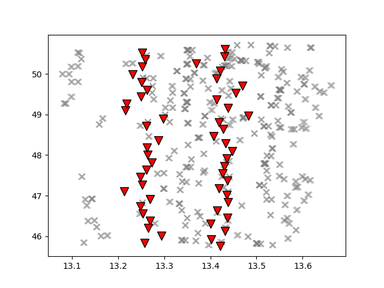
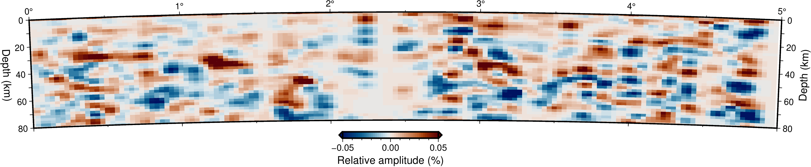

Example using a subset of data
==============

Introduction
~~~~~~~~~~~~
Here you can find a tutorial for calculating receiver functions and time-to-depth
calculation for a given subset of seismic waveform data from the EASI seismic network. Note
that this is only a small sample of all the available data and its only purpose
is to show the functionality of the codes. The example dataset is available in the
following `link <https://zenodo.org/record/7065029#.YxtWIdJByut>`__.

Here we start from continuous data cut around the arrival times of selected teleseismic events
and apply a systematic processing routine (see Figure 1 for details on the steps we follow).

.. figure:: images/RF_Migration_workflow.png
    :alt: Processing steps for Receiver Function and time-to-depth migration calculations.

    Processing steps for Receiver Function and time-to-depth migration calculations within ``rfmpy``.

Download example dataset
~~~~~~~~~~~~
First we need to download the seismic waveform data from a ZENODO
repository in our local computer.

1. Create a directory to store the waveform data:

.. code:: bash

   $ mkdir ~/Desktop/data_sample

2. Download the data sample from ZENODO in that directory along with two files (plot_EASI.sh,vk.cpt) that we will need later:

.. code:: bash

   $ wget https://zenodo.org/record/7292588/files/seismic_data.tar.xz -P ~/Desktop/data_sample/

.. parsed-literal::

    [2022-09-27 15:56:54]  https://zenodo.org/record/7065029/files/seismic_data.tar.xz
    Resolving zenodo.org (zenodo.org)... 188.184.117.155
    Connecting to zenodo.org (zenodo.org)|188.184.117.155|:443... connected.
    HTTP request sent, awaiting response... 200 OK
    Length: 141181064 (135M) [application/octet-stream]
    Saving to: ‘~/Desktop/data_sample/seismic_data.tar.xz’
    seismic_data.tar.xz.2             100%[==========================================================>] 134.64M  8.43MB/s    in 13s
    [2022-09-27 15:57:08] (10.2 MB/s) - ‘~/Desktop/data_sample/seismic_data.tar.xz’ saved [141181064/141181064]

.. code:: bash

   $ wget https://zenodo.org/record/7292588/files/plot_EASI.sh -P ~/Desktop/data_sample/
   $ wget https://zenodo.org/record/7292588/files/vik.cpt -P ~/Desktop/data_sample/

.. parsed-literal::

    Resolving zenodo.org (zenodo.org)... 188.184.117.155
    Connecting to zenodo.org (zenodo.org)|188.184.117.155|:443... connected.
    HTTP request sent, awaiting response... 200 OK
    Length: 602 [application/octet-stream]
    Saving to: ‘~/Desktop/data_sample/plot_EASI.sh.1’
    Saving to: ‘~/Desktop/data_sample/vik.cpt.1’
    plot_EASI.sh.1      100%[===================>]     602  --.-KB/s    in 0s
    vik.cpt.1           100%[===================>]   9.86K  --.-KB/s    in 0s

3. Extract files from the tar file we just downloaded:

.. code:: bash

   $ tar -xf ~/Desktop/data_sample/seismic_data.tar.xz --directory ~/Desktop/data_sample

4. Create a directory to store RFs:

.. code:: bash

    $ mkdir ~/Desktop/data_sample/RF
    $ mkdir ~/Desktop/data_sample/TRF

Calculate receiver functions
~~~~~~~~~~~~

Run the following, code snippet from the repository's top folder to compute receiver functions.

.. code:: ipython3

    import rfmpy.core.RF_Main as RF
    from obspy import read_inventory, read_events, UTCDateTime as UTC
    import os
    import time

    # Define working directory
    work_dir = os.getcwd()

    # Path in which waveforms are stored
    path_wavs = ['/home/' + work_dir.split('/')[2] + '/Desktop/data_sample/EASI/data/']

    # Define path to store RFs
    path_out_RF = '/home/' + work_dir.split('/')[2] + '/Desktop/data_sample/'

    # Start a timer to keep a track how long the calculations take
    t_beg = time.time()

    # Path for StationXML files
    path_meta = work_dir + '/data/metadata/'
    try:
        print('>>> Reading inventory...')
        inv = read_inventory(path_meta + '/*.xml')
        print('>>> Read inventory...')
    except Exception as e:
        raise type(e)('>>> Move to the top directory of the repository!')

    # =================================================== #
    # Define parameters for calculating receiver functions
    # Define sta/lta parameters
    sta_lta_qc_parameters = {'sta': 3, 'lta': 50, 'high_cut': 1.0, 'threshold': 2.5}

    # Define pre-processing parameters
    pre_processing_parameters = {'low_cut': 0.05, 'high_cut': 1.0, 'order': 2,
                                 't_before': 40, 't_after': 60}
    for path_wav in path_wavs:
        print(path_wav)
        RF.calculate_rf(path_ev=path_wav, path_out=path_out_RF, inventory=inv, iterations=200,
                        ds=30, c1=10, c2=10, sta_lta_qc=sta_lta_qc_parameters,
                        pre_processing=pre_processing_parameters, max_frequency=1, save=True, plot=False)
    # ==================================================== #
    t_end = time.time()
    total_time = t_end - t_beg
    print('It took ' + str(round(total_time)/60) + ' minutes in total.')

.. parsed-literal::

    [2022-09-27 15:58:01] >>> Reading inventory...
    >>> Read inventory...
    /home/*/Desktop/data_sample/EASI/data/
    Calculating RF for event in: /home/*/Desktop/data_sample/EASI/data/P_2014.363.09.29.37
    ...
    >>> Station: XT.AAE50 - Failed on QC 2.
    [2022-09-27 16:57:08] It took 20 minutes in total.

This created 273 RF files in SAC format...

Calculate time-to-depth migration
~~~~~~~~~~~~
Now to compute time-to-depth migration for these RF traces we use the following
code snippet.

.. code:: ipython3

    import rfmpy.core.migration_sphr as rf_mig
    import rfmpy.utils.migration_plots_spher as plot_migration_sphr
    import os
    import time

    # Start a timer to keep a track how long the calculations take
    t_beg = time.time()

    # Define working directory
    work_dir = os.getcwd()

    # Define path to RFs
    path = '/home/' + work_dir.split('/')[2] + '/Desktop/data_sample/RF/'

    # Read station coordinates from the rfs (sac files) in a pandas dataframe
    sta = rf_mig.read_stations_from_sac(path2rfs=path)

    # Read RFs
    stream = rf_mig.read_traces_sphr(path2rfs=path, sta=sta)

    # =================================================== #
    # Define MIGRATION parameters
    # Ray-tracing parameters
    inc = 0.25
    zmax = 100
    # Determine study area (x -> perpendicular to the profile)
    minx = 0.0
    maxx = 30.0
    pasx = 0.05
    miny = 30.0
    maxy = 60.0
    pasy = 0.05
    minz = -5
    # maxz needs to be >= zmax
    maxz = 100
    pasz = 0.5
    # Pass all the migration parameters in a dictionary to use them in functions called below
    m_params = {'minx': minx, 'maxx': maxx,
                'pasx': pasx, 'pasy': pasy, 'miny': miny, 'maxy': maxy,
                'minz': minz, 'maxz': maxz, 'pasz': pasz, 'inc': inc, 'zmax': zmax}

    # Ray tracing
    # Pick one of the two velocity models
    # 'EPcrust' or 'iasp91'
    # We use EPcrust velocity model here...
    stream_ray_trace = rf_mig.tracing_3D_sphr(stream=stream, migration_param_dict=m_params,
                                              velocity_model='EPcrust')

    # Write piercing points in a file
    plot_migration_sphr.write_files_4_piercing_points_and_raypaths(stream_ray_trace, sta, piercing_depth=35, plot=True)
    # Migration
    mObs = rf_mig.ccpm_3d(stream_ray_trace, m_params, output_file="/home/" + work_dir.split('/')[2] + "/Desktop/data_sample/epcrust", phase="PS")
    total_time = time.time() - t_beg
    print('Time-to-depth migration took ' + str(round(total_time)/60) + ' minutes in total.')

.. parsed-literal::

    |-----------------------------------------------|
    | Reading receiver functions...                 |
    | Reading trace 0 of 273
    ...
    | 273 of 273
    | End of 3D ray tracing...                      |
    |-----------------------------------------------|

          at 35 km depth computed for each seismic station
          (inverted red triangles) using the EPcrust velocity model (Molinari and Morelli, 2011).

    Map showing the piercing points (gray crosses)
    at 35 km depth computed for each seismic station (inverted red triangles) using the EPcrust velocity model (Molinari and Morelli, 2011).

.. parsed-literal::

    |-----------------------------------------------|
    | Start of common conversion point stacking...  |
    | 1 of 273
    ...
    | 273 of 273
    | End of common conversion point stacking...    |
    |-----------------------------------------------|
    Time-to-depth migration took 0.7 minutes in total.

This provides us with a 3D grid (epcrust.npy) of stacked migrated RF amplitudes.

Plot migrated cross-sections
~~~~~~~~~~~~
We will use this 3D grid to plot the cross-section using GMT6.
Before we do this, we need to create the cross-section

.. code:: ipython3

    import rfmpy.core.migration_sphr as rf_mig
    import rfmpy.utils.migration_plots_spher as plot_migration_sphr
    import numpy as np
    import os
    import matplotlib.pyplot as plt
    from obspy.geodetics import degrees2kilometers, kilometers2degrees

    path2grid = '/home/' + work_dir.split('/')[2] + '/Desktop/data_sample/'

    # Read the 3D grid (epcrust.npy) of stacked migrated RF amplitudes.
    with open(path2grid + 'epcrust.npy', 'rb') as f:
        mObs_ep = np.load(f)

    profile = np.array([[13.35, 50.6], [13.35, 45.6]])
    profile_name = 'EASI'
    G2_, sta, xx, zz = plot_migration_sphr.create_2d_profile(mObs_ep, m_params, profile, sta, swath=37.5, plot=True)
    mObs = rf_mig.ccp_smooth(G2_, m_params)
    mObs = rf_mig.ccpFilter(mObs)

    # File for GMT plot
    for i, x in enumerate(xx):
        for j, z in enumerate(zz):
            print(kilometers2degrees(x), z, mObs[i,j])
            with open(path2grid + profile_name + '.txt', 'a') as of:
                of.write('{} {} {} \n'.
                         format(kilometers2degrees(x), z, mObs[i, j]))

.. code:: bash

    cd ~/Desktop/data_sample/
    conda deactivate
    conda activate gmt6
    bash plot_EASI.sh

    Map

